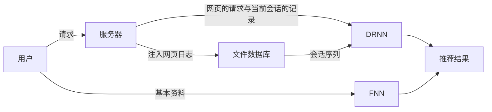
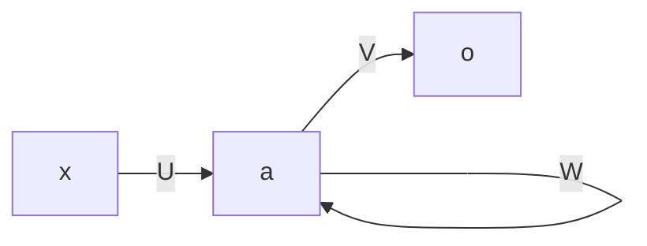

## 论文概述

该论文通过构建一个**深度循环神经网络**模型来解决一个系统推荐的问题：

- 无法利用用户**当前的**浏览历史来提供**实时的**定制化推荐服务。

这个网络来用隐层来对用户访问过的网页进行**组合和顺序**上的建模。同时通过将旧的状态整合为**单一的历史状态**的方法来记录有限的状态数量，从而实现降低处理成本。

模型在用户每次打开新网页时刷新推荐结果，并随着用户会话的进行，模型的推荐结果会不断的精细化。

### 背景介绍

协同过滤算法：

- 基于用户与事物项之间的关联来预测用户选择每个项的概率。
- 缺点是依赖静态数据，无法实现定制化选择。

从该论文给出的场景示意图中可以发现：

- 基本属性
- **浏览行为的数据**（协同过滤算法缺失）

没有特殊信息可以获取时，回到使用协同过滤算法给出结果。

- 历史的购买记录
- 当前的浏览记录

这个任务的挑战在于：

- 网页数量大，如果每个网页代表一个状态，则用户的会话就成了一个随机的状态组合，向量的学习就会非常复杂。
- 访问的网页具有层级结构，想要对网页的访问顺序敏感，并能承受高并发。
- 训练集由用户的历史访问日志和最终购买组成，这是一个不断更新的集合，模型并不是一次训练而成，必须能够实时响应新的用户特征。

用户的访问特征：页面的顺序显示了用户到目标的路径。 DRNN 目标在于得到一个实时的推荐系统能缩短这个路径。

窗口大小在精确度与复杂度之间的权衡，将历史记录简化为单一虚拟历史状态与当前活跃的记录状态结合。

前馈神经网络模拟协同过滤算法，输入历史购买向量，输出购买某项的预测概率。

模型的自动调整框架，运用遗传算法提高预测的精确度，降低了部署的负载。

### 模型介绍

传统的方法存在的问题：

- 用户最终购买推荐的物品的概率很低。

- 离线的方法不能发现用户最新的购买特征。

为了解决上述问题，该论文建立了如下的架构（这里省略了返回路径）：

在完成一次会话后，推荐结果的购买结果可以作为新的训练样例来调整模型。

会话文件的产生有如下两个情况：

- 如果一条**新会话**的日志出现，则原来会话的所有日志生成一个会话文件。
- 如果一个**预设的时间内没有新会话**文件生成，则当前会话的所有日志生成一个会话文件。

那么一个会话文件包含多个日志文件，简化为它们的 URL 请求根据时间戳形成的一个时间序列。

#### 深度循环神经网络

下面显示了一个基本的循环神经网络：

- $a(i)=f(Ux(i)+Wa(i-1))$
- $o(i)=softmax(Va(i))$

通过增加隐层数形成深度神经网络。但是由于存储的限制，不可能使用无限多的状态，该论文引入了一个**历史状态**来处理溢出的旧数据。这个历史状态的向量是其包含的向量的加权求和，其中权重被设计为是一个**老化因子**基于当前数据与所有的目标数据之和的特定比率。

利用协同过滤 CF 来捕获用户与商品上用户间共同的兴趣，即购买一些相同商品的用户间存在相似的商品倾向和兴趣。该论文的 RNN 模型作为在协同过滤的基础上对于用户的特异性补充，而**本文使用 FNN 来模拟 CF** 。（作为论文概述，这里对于本文中的技术实现细节不描述。）

### 优化与实验

优化的两个目标：

1. 提高精确度
2. 提高学习速度

该论文所做了一些探索性的解决方案（技术细节详见论文）：

- 自动代码生成：输入参数配置文件，输出模型对应的脚本文件。
- 模型调参：利用遗传算法。

其中实验验证了上述方案满足优化目标。

## 个人感悟和改进方案

在阅读该论文时，发现该论文的模型的一个基本假设是：用户的访问路径（特别是当前范围内的）与最终的购买决策（或意图和兴趣等）有关。

这是一个很好的出发点，不同于协同过滤的相对静态的数据，它认为除了决策结果能表明用户特征外，用户**行为**也能反映用户特征。

那么这也为我提供了下图一个思考改进方案的方向：还有哪些可观测数据可以反映用户行为？

我尝试这样描述一个显式的需求：一个用户开始大量浏览某种品类的不同产品，那么这个用户明显地有购买该种商品的需求。对于这样的需求，推荐系统的一个任务就是提供一些符合用户预期的**同种**商品。

结合我个人在购买物品的场景：我会在特别想买的某种物品时深入了解物品的一些相关数据和其他用户评论，这就形成了在单个网页上的可测量深度。所以在该论文抓住访问网页的时间序列的横向基础上，我认为可以在某个网页点上引入纵向维度：

- 页面的**停留时间**
- 页面的**阅读完成度**

首先是页面的停留时间，测量办法为：当用户请求某个页面后，服务器响应并激活用户本地的计时器，在用户触发离开页面的事件时返回记录的时间。

其次是页面的阅读完成度。这里设想了两个测量方案：

1. 简单地估计为页面所处位置的深度，即页面当前位置距离页面顶端的距离。
2. 基于页面信息结构的分段深度。假设将页面做单一线性的分层模板，如依次为商品简介、参数详情、用户评论三个层次。理论上，页面信息架构必须存在优先级，测量结果为递进的关系，用户触及越后面的层次时返回表示越高关注度和完成度的估计值。

同样地，测量数据在用户触发离开页面的事件时返回服务器。

显然，这里从路径上的单一访问节点来看，只能简单**确定用户是否关注当前物品**，而结合该论文所描述的整体路径来看，会起到更好的预期结果。

而推荐系统的真正目标在于挖掘用户**潜在的**需求。从协同过滤算法来看，结合用户间的相似性是一个很好的解决办法。那么我就设想另一种方法通过对多个用户的购买商品向量进行聚类分析（？）。

其实，对于用户关注度高但尚未购买（或一段时间内没有再购买）的商品品类，可以构建定制的用户数据库，并作为推荐系统的默认结果在用户二次登入（或一定天数后）返回，达到适时地激活用户已被验证的潜在需求，从而提高推荐商品的购买率。

由于缺乏系统的论证，上述方案可能存在缺陷，仅作参考。

_If you find any bugs about this blog please contact me!_
